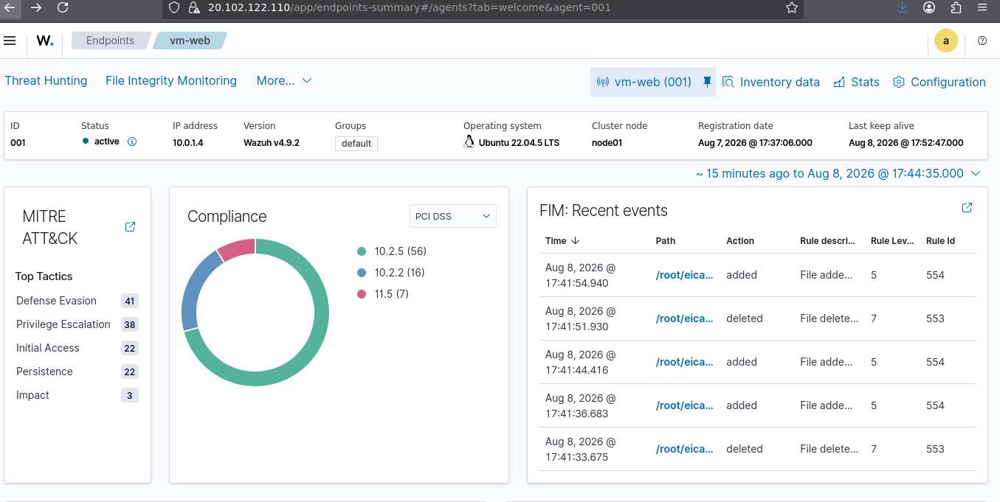

# File Integrity Monitoring (FIM) — Activity Overview

## Objective
Validate that Wazuh's FIM module is actively and continuously 
monitoring file-system changes on `vm-web`, beyond a single 
test-file event.

## Observed Activity
The FIM dashboard shows a stream of real-time file events under 
`/root/eica...` — alternating "added" (rule ID 554, level 5) and 
"deleted" (rule ID 553, level 7) actions occurring within seconds 
of each other. This confirms FIM is tracking file creation and 
deletion events continuously, not just on a one-time basis.

The endpoint summary also surfaces additional context for the same 
agent:
- **MITRE ATT&CK Top Tactics**: Defense Evasion (41), Privilege 
  Escalation (38), Initial Access (22), Persistence (22), Impact (3)
- **PCI DSS Compliance breakdown**: requirements 10.2.5 (56 events), 
  10.2.2 (16), 11.5 (7)

## Screenshot

## Analysis
Continuous add/delete events on the same path indicate repeated 
file-system activity being tracked in near real-time — useful for 
detecting persistence mechanisms (e.g. an attacker repeatedly 
dropping and removing files to evade static detection). The 
compliance panel also shows how FIM activity maps directly to PCI 
DSS requirements around file integrity and change monitoring 
(10.2.5, 10.2.2), which is relevant in client-facing/compliance-
driven SOC environments.

## What This Demonstrates
Understanding of FIM as a continuous monitoring capability (not 
just single-event detection), and the ability to connect technical 
alerts to compliance requirements — a skill directly relevant to 
client-facing analyst roles.
