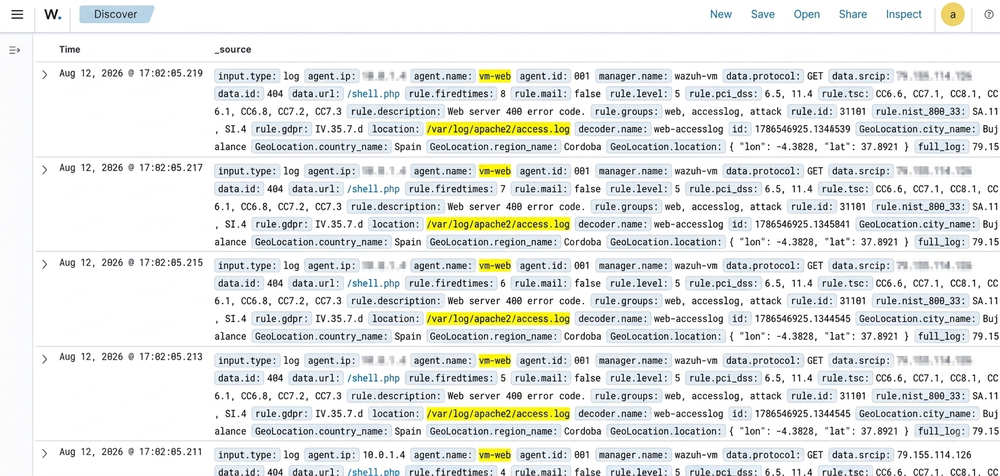

# Webshell Access Attempt Detection

## Objective
Detect attempts to access known webshell filenames on the web 
server — a common technique attackers use to check if a 
previously-uploaded webshell is accessible, or to probe for 
common backdoor file names.

## Observed Activity
A source IP sent repeated GET 
requests to `/shell.php` in rapid succession (multiple requests 
within milliseconds of each other), all returning HTTP 404 — 
indicating no such file exists on the server. The request pattern 
and timing are consistent with automated scanning rather than 
manual browsing.

## Detection
Wazuh's web server ruleset flagged each request via rule ID 
`31101` ("Web server 400 error code"), rule level 5, under the 
`web`, `accesslog`, and `attack` rule groups. GeoIP enrichment 
provided additional context, attributing the source to Cordoba, 
Spain.

## Screenshot

*Note: source IP addresses in the screenshot have been manually 
redacted before publishing.*

## Analysis
Requests targeting `/shell.php` specifically (rather than random 
paths) suggest the attacker was checking for the presence of a 
known/common webshell filename — a technique often used either to 
verify a prior compromise, or as part of automated scanning tools 
that test for commonly-named backdoors left by other attackers. 
The 404 responses confirm no such file exists on this server, but 
the attempt itself is a reconnaissance-stage indicator worth 
tracking, especially if seen repeatedly from the same or related 
source IPs.

## What This Demonstrates
Ability to recognize webshell-probing patterns distinct from 
generic content discovery, and use of GeoIP-enriched log data to 
add context to threat analysis.
