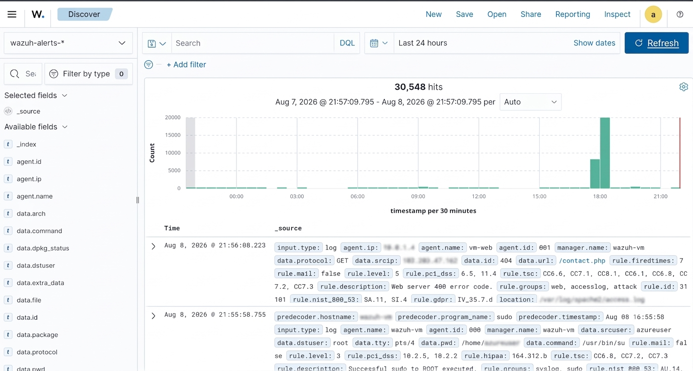
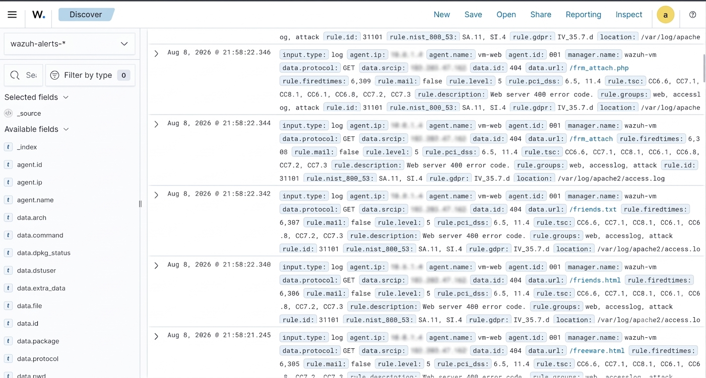

# Directory / Content Discovery Scan Detection

## Objective
Detect automated web content-discovery scanning — an attacker probing 
for hidden files, pages, or directories — using Wazuh's web server 
log monitoring.

## Observed Activity
A single source IP repeatedly sent GET requests to a wide range of 
non-existent URLs (e.g. `/frm_attach.php`, `/friends.txt`, 
`/friends.html`, `/freeware.html`, `/contact.php`) in rapid 
succession, all returning HTTP 404 responses. The pattern — many 
different paths, no legitimate referrer flow, and sub-second timing 
between requests — is consistent with automated scanning tools 
(e.g. Dirbuster, Gobuster, Nikto) rather than normal user browsing.

A related event around the same window also showed a successful 
`sudo` escalation to root on the monitored host, which was reviewed 
alongside the scan activity as part of the same analysis window.

## Detection
Wazuh's default Apache/web server ruleset flagged each request via 
rule ID `31101` ("Web server 400 error code"), rule level 5, tagged 
under the `web`, `accesslog`, and `attack` rule groups. The 
`rule.firedtimes` field showed the count climbing rapidly within 
seconds of each other, confirming a high-frequency, repeated pattern 
from the same source. Total alert volume for the 24-hour window was 
30,548 hits, with a clear traffic spike visible around 18:00 
correlating with this scan.

## Screenshots

*Note: source IP addresses in the screenshots have been manually 
redacted before publishing.*

## Analysis
The scan generated a large volume of near-identical 404 alerts in a 
short window. While each individual event is low-severity (level 5), 
the volume and pattern indicate reconnaissance activity — an 
attacker mapping the web server for accessible or vulnerable 
endpoints before attempting further exploitation. This is a common 
early-stage attack pattern SOC analysts are trained to catch before 
it escalates.

## What This Demonstrates
Understanding of web-layer reconnaissance detection, log pattern 
analysis, and the ability to distinguish automated scanning behavior 
from normal traffic based on request frequency and path diversity.
