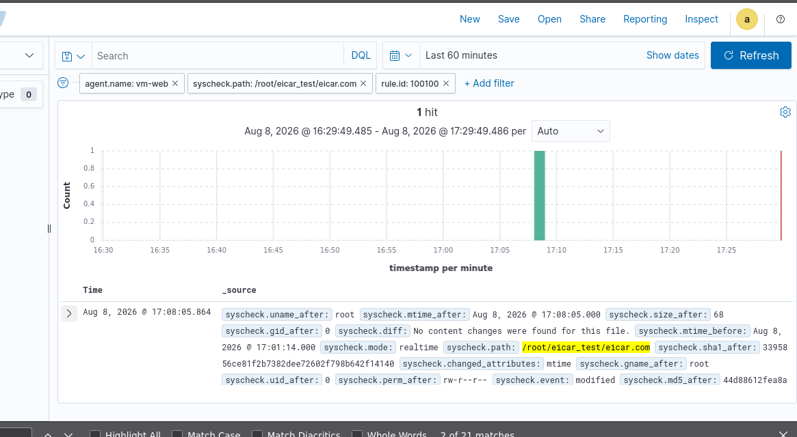

# Malicious File Detection (EICAR Test)

## Objective
Validate Wazuh's ability to detect the presence of a known 
malicious/test file on a monitored host, simulating a scenario 
where an attacker drops a file post-exploitation.

## Simulation
An EICAR test file (`eicar.com`) — a standard, harmless file used 
industry-wide to safely test antivirus and detection systems 
without using real malware — was placed in `/root/eicar_test/` on 
the `vm-web` host.

## Detection
Wazuh's FIM (syscheck) module detected the file within its 
real-time monitoring scope, triggering rule ID `100100`. The alert 
captured full file metadata:
- Path: `/root/eicar_test/eicar.com`
- SHA1 hash: `56ce81f2b7382dee72602f798b642f14140`
- Owner: root, permissions: `rw-r--r--`
- Event type: modified
- Detection latency: sub-minute (single hit within the 60-minute 
  monitoring window)

## Screenshot

## Analysis
The detection confirms syscheck correctly flagged the introduction 
of a new file matching a known test signature. In a production 
environment, this same mechanism would trigger on webshells, 
malware droppers, or other unauthorized files placed by an attacker 
following successful exploitation — making FIM a critical 
post-exploitation detection control, especially useful when the 
initial access vector itself goes unnoticed.

## What This Demonstrates
Practical validation of File Integrity Monitoring as a malicious 
file detection mechanism, and understanding of how FIM complements 
perimeter/network-based detections by catching threats at the 
host/filesystem level.
