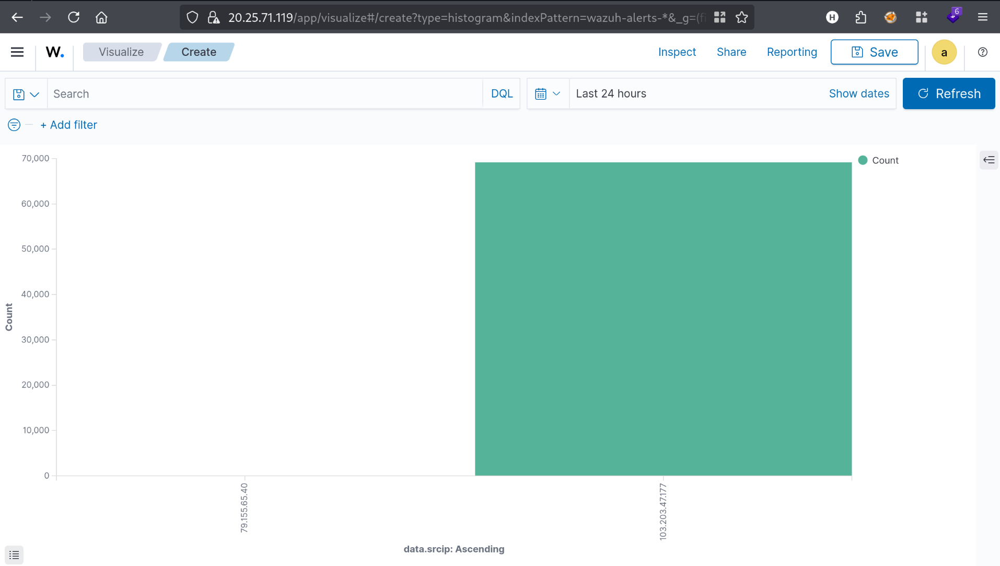
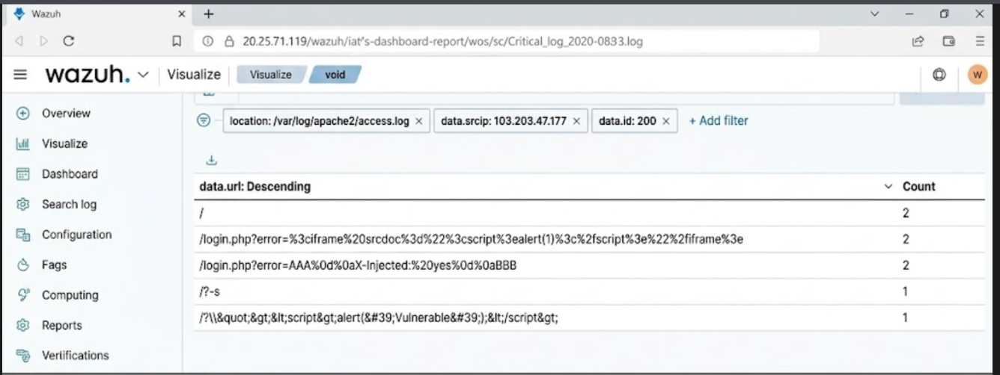

# Malicious HTTP Requests Detection (XSS / Header Injection)

## Objective
Identify web application attack attempts — specifically XSS and 
HTTP header/response-splitting injection — targeting the login 
page, using Wazuh log analysis and custom visualizations.

## Observed Activity
Source IP `103.203.47.177` (the same IP previously seen performing 
content-discovery scanning) sent multiple crafted requests to 
`/login.php`, including:

- **XSS via iframe**: `<iframe srcdoc="">`
- **HTTP Header/CRLF Injection**: `AAA\r\nX-Injected: yes\r\nBBB` 
  — an attempt at HTTP response splitting via carriage-return/
  line-feed injection in a request parameter
- **Reflected XSS**: ``
- Parameter fuzzing (`?-s`)

A custom Visualize chart comparing `data.srcip` volumes confirmed 
this IP accounted for the overwhelming majority of traffic in the 
24-hour window, distinguishing it clearly from background/benign 
traffic.

## Detection
Requests were surfaced by filtering `location: /var/log/apache2/
access.log` combined with the source IP and grouping by `data.url`, 
allowing quick identification of every distinct malicious payload 
attempted against the login endpoint.

## Screenshots

## Analysis
This activity represents a progression from the earlier 
reconnaissance (content-discovery scan) to active exploitation 
attempts against a specific, high-value endpoint (`/login.php`). 
The presence of both XSS and header-injection payloads indicates 
the attacker was testing for multiple vulnerability classes rather 
than a single specific flaw — a common approach in automated 
vulnerability scanners and manual pentest-style probing alike.

## What This Demonstrates
Ability to correlate reconnaissance and exploitation-stage traffic 
from the same source, construct custom log visualizations to 
prioritize investigation, and recognize distinct web attack payload 
types (XSS, CRLF injection) from raw access logs.
