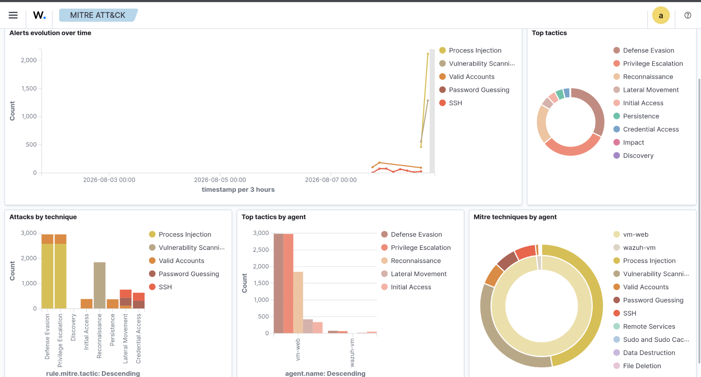

# MITRE ATT&CK Technique Correlation

## Objective
Use Wazuh's MITRE ATT&CK module to identify the broader attack 
pattern behind the individual alerts observed on `vm-web`, rather 
than treating each alert in isolation.

## Findings
Alerts correlated to MITRE ATT&CK mapped predominantly to two 
tactics — **Defense Evasion** and **Privilege Escalation** — both 
driven by a high volume of **Process Injection** technique alerts 
(~3,000 each). **Reconnaissance** (via Vulnerability Scanning) was 
the third most common tactic, followed by smaller volumes of 
Password Guessing and SSH-related activity under Lateral Movement / 
Credential Access.

The timeline shows reconnaissance and credential-related activity 
occurring first, followed by a sharp spike in Process Injection 
alerts later in the same window — consistent with a typical 
attack progression: recon → access attempts → escalation.

## Screenshot

## Analysis
Rather than viewing the content-discovery scan (reconnaissance) and 
the process injection alerts as unrelated events, the MITRE mapping 
suggests they may represent stages of a single attack chain on the 
same host (`vm-web`). This reinforces the value of correlating 
alerts by tactic/technique rather than reviewing them individually.

## What This Demonstrates
Ability to use MITRE ATT&CK as an analytical framework to connect 
disparate alerts into a coherent attack narrative — a core skill 
in SOC threat hunting and incident triage.
