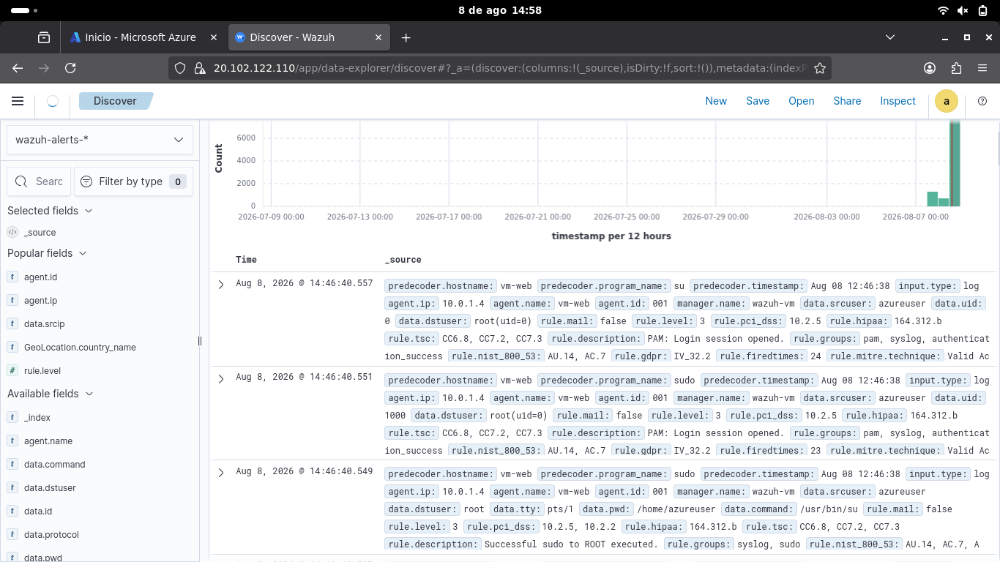

# Privilege Escalation Monitoring (Sudo/Root Activity)

## Objective
Establish visibility into privilege escalation activity (sudo/root 
access) on `vm-web`, creating a baseline of expected admin behavior 
that can be used to detect anomalous privilege escalation in the 
future.

## Observed Activity
Wazuh captured a full authentication and privilege escalation 
sequence for user `azureuser`:
1. PAM login session opened
2. `sudo` invoked, successfully escalating to root (`uid=0`)
3. Command executed as root

All events were tagged under MITRE ATT&CK technique **"Valid 
Accounts"**, correctly identifying this as legitimate, credentialed 
access rather than an exploitation attempt.

## Detection
Events were surfaced via Wazuh's Discover module, filtered on 
`agent.name: vm-web`, showing `rule.description` values "PAM: Login 
session opened" and "Successful sudo to ROOT executed" (rule level 
3), each mapped to relevant PCI DSS and NIST 800-53 compliance 
controls (10.2.5, AU.14, AC.7).

## Screenshot

## Analysis
While this specific activity is legitimate (a known admin account 
performing expected actions), establishing this as a monitored 
baseline is valuable: any future sudo/root escalation from an 
unrecognized account, at an unusual time, or without a preceding 
valid login session would stand out as anomalous against this 
known-good pattern. This reflects how SOC teams use "normal" 
activity monitoring to sharpen detection of privilege escalation 
attacks.

## What This Demonstrates
Understanding that SOC monitoring isn't limited to attack 
detection — tracking and baselining legitimate privileged access is 
equally important for building accurate, low-false-positive 
detection over time.
