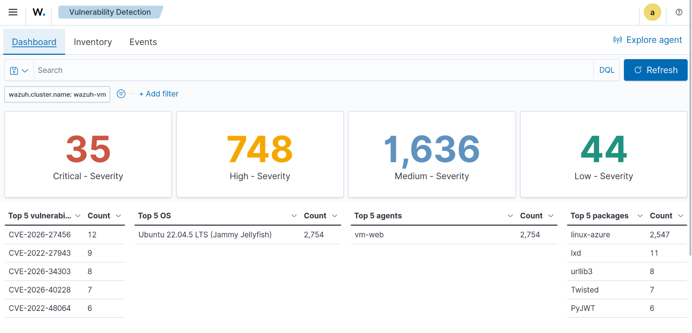
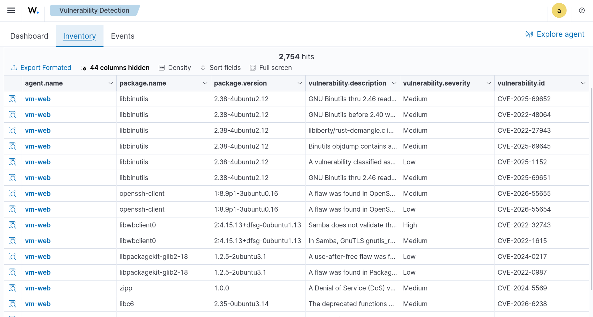

# Vulnerability Assessment — vm-web

## Objective
Identify and prioritize known vulnerabilities on the monitored host 
using Wazuh's Vulnerability Detection module.

## Findings
Total of 2,754 vulnerabilities detected on agent `vm-web` 
(Ubuntu 22.04.5 LTS):
- Critical: 35
- High: 748
- Medium: 1,636
- Low: 44

The `linux-azure` kernel package accounted for the majority of 
findings (2,547), followed by smaller counts in `lxd`, `urllib3`, 
`Twisted`, and `PyJWT`.

## Screenshots

## Prioritization
Critical and High severity findings were prioritized first, with 
particular attention to kernel-level vulnerabilities given their 
system-wide impact. `CVE-2026-27456`, present across multiple 
packages (bsdextrautils, libfdisk1), was flagged for review due to 
its recurrence.

## Recommendation
- Apply available OS/kernel patches via standard update channels
- Re-scan post-patching to confirm remediation
- Establish a recurring vulnerability scan cadence (e.g. weekly) 
  rather than a one-off assessment

## What This Demonstrates
Practical vulnerability management workflow — identification, 
severity-based triage, and remediation planning, mirroring how a 
SOC/vulnerability analyst would approach patch prioritization in a 
real environment.
